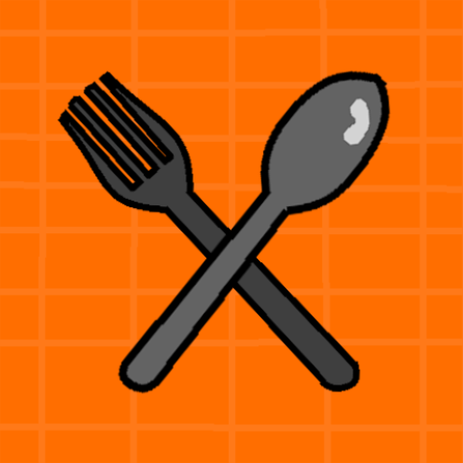
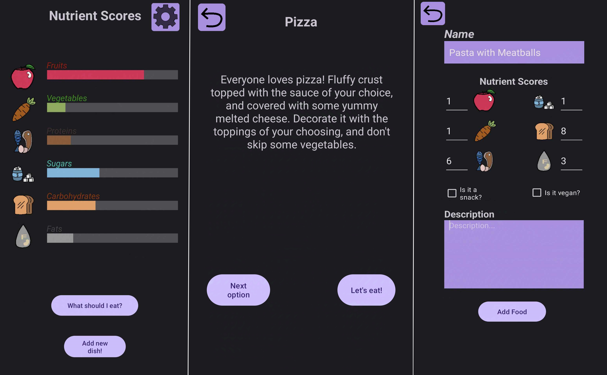

 
    

<h1> 
Dishider
 </h1>

[![Contributors][contributors-shield]][contributors-url]
[![Commits][commits-shield]][commits-url]
[![Forks][forks-shield]][forks-url]
[![Stargazers][stars-shield]][stars-url]
[![Issues][issues-shield]][issues-url]
[![MIT License][license-shield]][license-url]

#### An android application written in Java, that helps users select meals based on their personal preferences and nutritional requirements, offering tailored suggestions to support a balanced and healthy diet.

</h4>
Ever wanted to cook something or order takeout but couldn’t decide what? Do the numerous choices modern society offers simply make things more difficult? <strong>Dishider</strong> has you covered. This app chooses a meal for you by taking into account your personal preferences, previously consumed meals, and even nutritional values and needs. Whether you're vegan, a health enthusiast, or just in the mood for a snack instead of a full meal, <strong>Dishider</strong> is the right application for you!

## Features

* What should I eat? With the press of a button, the application generates a ranked list of food options by taking into account (should the user wish);
  * Nutritional values from 6 distinct categories.
  * Meal type, by offering either snacks, full meals or both.
  * Vegan-friendly options.
  * History of previously consumed meals for increased variety.
* Nutrient Scores. With 6 distinct nutrient categories, the application will try to find meals that balance your scores near the middle. The chosen categories are; Fruits, Vegetables, Proteins, Sugars, Carbs and Fats. Consuming a meal dynamically alters these values and presents them to the user.
* Customisable meal list using Android's Room Database, allowing the user to expand the pre-existing list with new flavorful options. Added custom meals can as easily be removed.

## Future Work & Ideas

* Bluetooth capabilities for exchanging and sharing custom meals.
* Multiple Language support for world-wide accesibility.
* In-app achievements for a more fun and interactive usage.
* AI usage for estimating nutrient scores using pictures (or descriptions).

## Preview

 

[contributors-shield]: https://img.shields.io/github/contributors/NickTaflampas/Dishider
[commits-shield]: https://img.shields.io/github/last-commit/NickTaflampas/Dishider
[forks-shield]: https://img.shields.io/github/forks/NickTaflampas/Dishider
[stars-shield]: https://img.shields.io/github/stars/NickTaflampas/Dishider
[issues-shield]: https://img.shields.io/github/issues/NickTaflampas/Dishider
[license-shield]: https://img.shields.io/github/license/NickTaflampas/Dishider

[contributors-url]: https://github.com/NickTaflampas/Dishider/graphs/contributors
[commits-url]: https://github.com/NickTaflampas/Dishider/commit/main
[forks-url]: https://github.com/NickTaflampas/Dishider/network/members
[stars-url]: https://github.com/NickTaflampas/Dishider/stargazers
[issues-url]: https://github.com/NickTaflampas/Dishider/issues/
[license-url]: https://github.com/NickTaflampas/Dishider/blob/main/LICENSE
